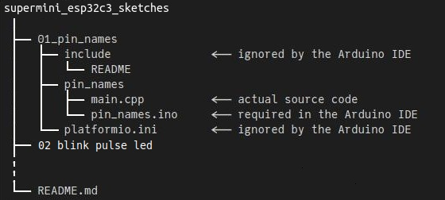

# Super Mini ESP32C3 Arduino Sketches / PlatformIO Projects


---

**Table of Content**

<!-- TOC -->

- [1. Setup](#1-setup)
- [2. Introduction](#2-introduction)
- [3. Arduino IDE Notes](#3-arduino-ide-notes)
- [4. PlatformIO Notes](#4-platformio-notes)

<!-- /TOC -->

## 1. Setup

See [./resources](/resources)  for more info.

## 2. Introduction

The Super Mini ESP32C3 boards are small simplified versions of the original Espressif development boards for the ESP32-C3 microcontroller. Unlike older Espressif microcontrollers, the C3 has a RISC-V core. 

It seems that there is more than one manufacturer of these boards that differ in more or less subtle ways. The pin diagram above shows the markings on four boards purchased from a Chinese vendor in late April 2024. There are no labels identifying the red power LED to the left of the USB connector and the blue LED under the reset (RST) button. There are no other components near the single component between the ESP32-C3 chip and the red ceramic antenna labelled C3. Other boards and the [schematic](https://wiki.icbbuy.com/doku.php?id=developmentboard:esp32-c3mini#schematic) have other components which may explain the problems encountered with Wi-Fi connectivity. 

It should be possible to compile these projects in the Arduino IDE or in PlatformIO, although there are difficulties in a couple of cases if using the Arduino IDE.

## 3. Arduino IDE Notes

Arduino sketches must have an `.ino` file name extension and must be contained in a directory that has the same name as the Arduino sketch (excluding the extension). Consequently the `01_pin_names` project contains a directory named `pin_names` that in turn contains the Arduino sketch `pin_names.ino`. That file is only a long comment. This is not a problem because the Arduino IDE will import all source files found in the sketch directory. The actual code is in `main.cpp` which is the default name of a PlatformIO project.

 

To compile and then upload the sketch in the Arduino IDE, click on the **File** top menu, click on **Open...**, then navigate to the `pin_names.ino` file and open it with the system file manager.

Following the instructions in [Installing using Arduino IDE](https://docs.espressif.com/projects/arduino-esp32/en/latest/installing.html#installing-using-arduino-ide) the latest release of the Arduino-ESP32 framework was installed by entering the following URL 
```
https://espressif.github.io/arduino-esp32/package_esp32_index.json
```
into the `Additional Board Manager URLs` field of the Arduino Preferences. Using the board manager install the Espressif Arduino core `esp32 version 3.0.1` or newer. It should then be possible to select `MakerGO ESP32 C3 SuperMini` as the board.

## 4. PlatformIO Notes

Because of the Arduino sketch naming constraints, the `main.cpp` file of a project is not stored in the default `src` directory. A `src_dir` entry in the `platformio.ini` configuration file provides the name of the directory in which `main.cpp` is found. That will be the name of the Arduino sketch as shown below for the `01_pin_names` project. 

```ini
[platformio]
; Make the Arduino IDE happysupermini_esp32c3_sketches (github)%  (.INO file must be in a directory of the same name)
src_dir = pin_names
```

PlatformIO will "convert" the sketch `.ino` file, but that is of no consequence since it contains only comments.


